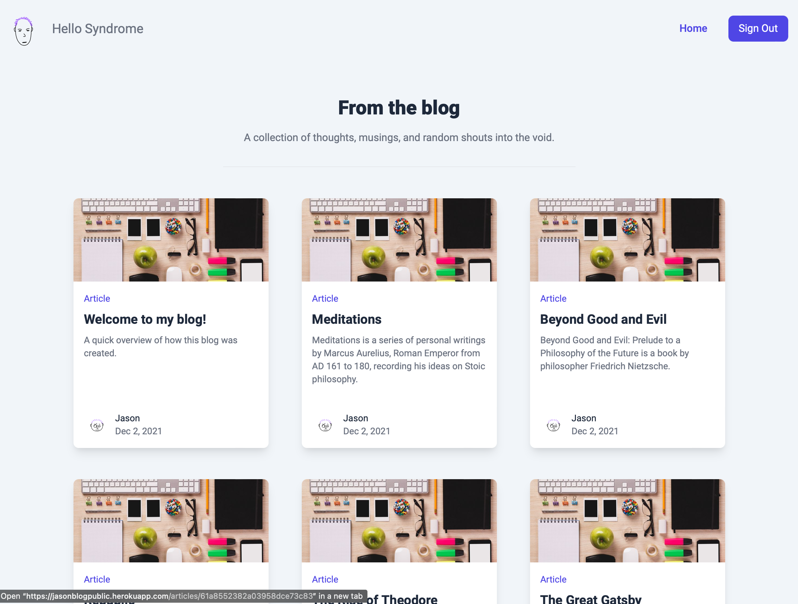

# blog-public

This is the public frontend of my personal blog. This app was created as part of an assignment for The Odin Project.

## Live links

- [Public Blog](https://jasonblogpublic.herokuapp.com/articles)
- [Private Blog Manager](https://secret-springs-08504.herokuapp.com/signin)
- [Blog Content API](https://vast-beyond-74815.herokuapp.com/articles)

  

## Related repositories

- [Blog API](https://github.com/Atlas-1510/blog-api)
- [Private Blog Manager](https://github.com/Atlas-1510/blog-cms)

## Attributions

- [React](https://reactjs.org/) - framework
- [dicebear](https://avatars.dicebear.com)- custom profile images
- [react-router-dom](https://v5.reactrouter.com/web/guides/quick-start)- routing
- [TailwindCSS](https://tailwindcss.com) - styling
- [react-icons](https://react-icons.github.io/react-icons/) - GitHub icon
- [axios](https://axios-http.com) - API integration
- [jsrsasign](https://www.npmjs.com/package/jsrsasign) - JSON web token processing
- [Insomnia](https://insomnia.rest) - API testing
- [TinyMCE](https://www.tiny.cloud) - web text editor

## License

[MIT](https://choosealicense.com/licenses/mit/)
